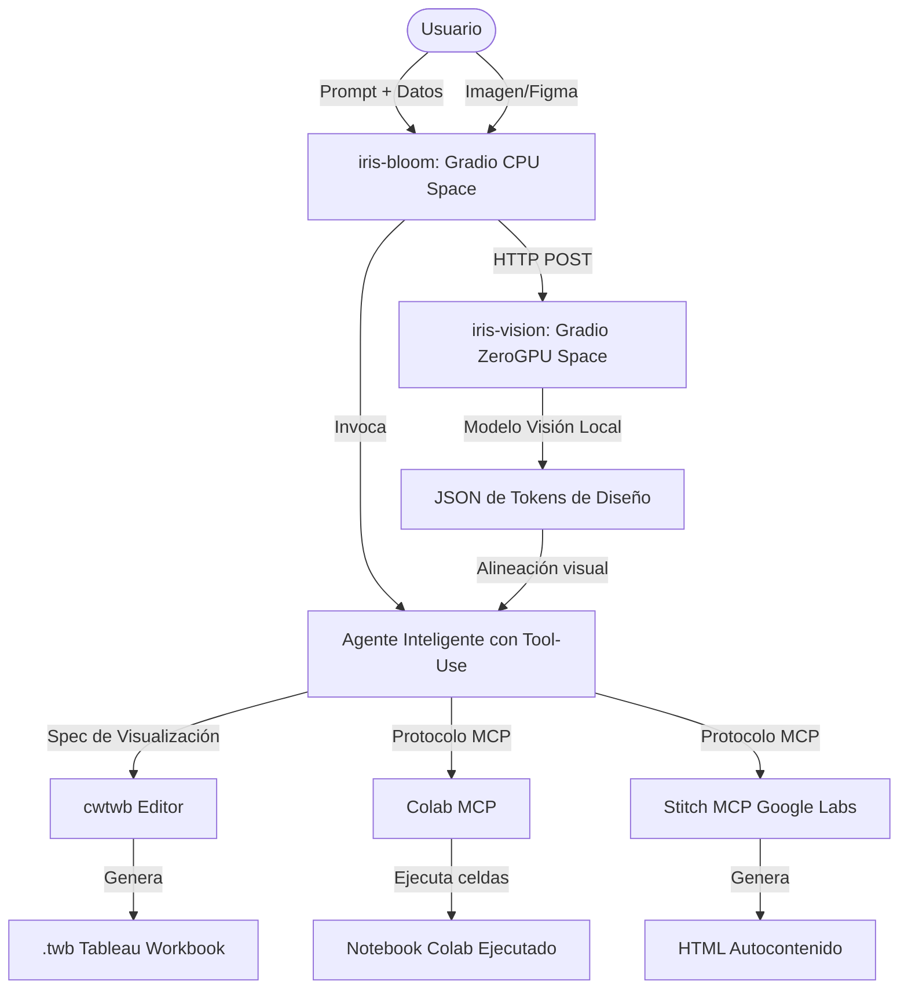

# Iris Bloom — Plataforma de Agentes de Análisis de Datos

> **Organización:** Iris Startup Lab · Área de Innovación  
> **Estado:** Prototipo / En fase de reestructuración (Rebranding desde *Nexus AI Studio*)  
> **Tema Visual:** Synthetic Precision (Modo Oscuro, alta densidad de datos)

---

### Autor

Fernando Dorantes Nieto

## Visión del Proyecto

**Iris Bloom** es una plataforma avanzada para el desarrollo y despliegue de **agentes conversacionales de análisis de datos**. Su objetivo es permitir a científicos de datos, analistas y usuarios de negocio interactuar mediante lenguaje natural para generar análisis automáticos y exportables en dos grandes vertientes:

1. **Análisis Descriptivo (Visualización)**:
   - Generación y edición offline de tableros de **Tableau** (`.twb`) mediante la librería `cwtwb`.
   - Generación de reportes interactivos autocontenidos en **HTML** e inyección de gráficos interactivos (Plotly/Altair) con layouts optimizados.
2. **Análisis Inferencial y Prescriptivo (Modelado)**:
   - Creación y ejecución dinámica de celdas de código en notebooks de **Google Colab** a través del protocolo MCP (Model Context Protocol).

---

## 🛠️ Arquitectura Objetivo

La plataforma está evolucionando hacia un esquema híbrido y modular distribuido en dos Spaces de Hugging Face para aprovechar la aceleración por hardware bajo demanda:



### Componentes Clave

- **`iris-bloom` (Space Principal en CPU gratis)**: Aloja la interfaz conversacional de Gradio, el agente de IA multi-turno (Claude API / LiteLLM) y la lógica de negocio para Tableau y Colab.

- **`iris-vision` (Space Secundario en ZeroGPU)**: Procesa capturas de pantalla o diseños (`.fig`) con un modelo de visión artificial local para extraer y alinear los tokens de diseño visual (colores, tipografías, espaciado) automáticamente con el tema **Synthetic Precision**.

---

## 📋 Inventario y Estado del Código Actual

El prototipo actual (denominado técnicamente *Nexus AI Studio* en el código de base) utiliza una arquitectura en **Streamlit** y está en proceso de migración al stack unificado de **Gradio**.

```
📁 Pipeline_data_analytics_and_mcps
├── 📁 .streamlit/               # Configuración del servidor Streamlit
├── 📁 modules/                  # Módulos de lógica de negocio (Python)
│   ├── board_generator.py      # Generación simulada de payloads MCP para Tableau
│   ├── cwtwb_runner.py         # Lógica real de edición y guardado de archivos XML .twb
│   ├── data_validator.py       # Escaneo de calidad de datasets, tipos de datos e inconsistencias
│   ├── design_parser.py        # Parser del archivo de configuración del sistema de diseño
│   └── notebook_generator.py   # Plantillas estáticas para notebooks (sin ejecución real)
├── 📁 pages/                    # Vistas de la aplicación clásica Streamlit
│   ├── data_center.py          # Dashboard de carga de datos e inspección de calidad
│   ├── dashboard_generator.py  # Interfaz para configurar tableros descriptivos
│   └── notebook_lab.py         # Interfaz para configurar notebooks analíticos
├── 📄 DESIGN.md                # Ficha técnica del sistema de diseño (Synthetic Precision)
├── 📄 PLAN_DE_MEJORAS.md       # Hoja de ruta para el desarrollo del Agente y clientes MCP
├── 📄 requirements.txt         # Dependencias del proyecto
└── 📄 streamlit_app.py         # Punto de entrada de la aplicación Streamlit heredada
```

---

## 🚀 Guía de Instalación y Uso (Prototipo Actual)

### 1. Requisitos Previos

- Python 3.10 o superior.

- Conexión a Internet para la instalación de dependencias y obtención de modelos (API keys opcionales).

### 2. Configuración del Entorno

Clona o descarga este repositorio en tu máquina local y crea un entorno virtual:

```bash
# Crear entorno virtual
python -m venv venv

# Activar entorno (Windows)
.\venv\Scripts\activate

# Activar entorno (Linux/macOS)
source venv/bin/activate
```

Instala las dependencias requeridas:

```bash
pip install -r requirements.txt
```

### 3. Configuración de Variables de Entorno

Copia el archivo de plantilla `.env.example` a `.env` y añade tus claves de API si deseas usarlas:

```env
DEEPSEEK_API_KEY=tu_api_key_aqui
GEMINI_API_KEY=tu_api_key_aqui
```

### 4. Ejecución de la Interfaz Web

Para iniciar la interfaz actual basada en Streamlit:

```bash
streamlit run streamlit_app.py
```

Abre tu navegador en la dirección local indicada (usualmente `http://localhost:8501`).

---

## 🗺️ Hoja de Ruta (Plan de Mejoras)

De acuerdo con el documento [PLAN_DE_MEJORAS.md](file:///e:/Users/1167486/Local/scripts/Pipeline_data_analytics_and_mcps/PLAN_DE_MEJORAS.md), las actividades de desarrollo se estructuran de la siguiente manera:

- **Fase 0 (Saneamiento y Rebranding)**: Corrección de rutas relativas de diseño, reemplazo del parser regex por `PyYAML`, unificación de inferencia de dtypes con `DataValidator` y renombrado a *Iris Bloom*.
- **Fase 1 (Núcleo e Interfaz en Gradio)**: Implementación de un cliente real de MCP, bucle de agente multi-turno con soporte para herramientas (`tool-use`), y migración de la interfaz Streamlit a **Gradio** estructurado en dos paneles (Chatbot + Canvas de Previsualización).
- **Track A (Tableau Descriptivo)**: Integración de `cwtwb` en las herramientas del agente y exportación real a archivos `.twb`.
- **Track B (Colab MCP)**: Automatización de la creación y ejecución interactiva de notebooks mediante `googlecolab/colab-mcp`.
- **Track C (Diseño Ingesta/Stitch)**: Conectores para Stitch MCP y extracción local de especificaciones visuales mediante modelos de visión en GPU.

---

## 📚 Referencias Oficiales

- [Tableau MCP](https://github.com/tableau/tableau-mcp) - Interacción con Tableau Cloud/Server.

- [Colab MCP](https://github.com/googlecolab/colab-mcp) - Ejecución interactiva de celdas de notebook.
- [cwtwb](https://github.com/imgwho/cwtwb) - Manipulación offline de workbooks Tableau (.twb).
- [Hugging Face ZeroGPU Spaces](https://huggingface.co/docs/hub/spaces-zerogpu) - Entorno de computación serverless para aceleración de visión.
